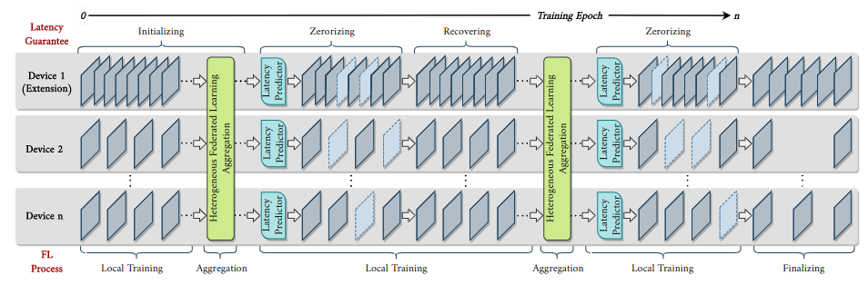

# Collate

This repository contains a pytorch implementation for "Collate: Collaborative Neural Network Learning for Latency-Critical Edge Systems"



Download all codes and open the Collate folder.

# Dependencies
NVIDIA-SMI 460.32.03    Driver Version: 460.32.03    CUDA Version: 11.2 conda 4.8.3

An [*environment.yaml*](environment.yaml) has been uploaded for creating a conda environment.

```shell
conda env create -f environment.yaml
```

# Dateset
The CIFAR-10, CIFAR-100 and MNIST datasets will be downloaded automatically by the scripts. And the HAR dataset can be downloaded
from [here](https://archive.ics.uci.edu/ml/machine-learning-databases/00240/UCI%20HAR%20Dataset.zip), organized as follow:


# Training
Under Open Source Review from HP Inc.


# Saved Models
All models (checkpoint) that are trained by our method in the paper are anonymously accessed at [Google Drive](https://drive.google.com/drive/folders/10pUEbVnXMzB7XmK71LugSTaR5VwPO95b?usp=sharing).

* har-iid:         IID part in TABLE I;
* har-noniid:      Non-IID part in TABLE I;
* cifar10-iid:     IID part in TABLE II;
* cifar10-noniid:  Non-IID part in TABLE II;
* cifar100-iid:    TABLE III.

For accuracy evaluation, 0 in each folder is for complexity-1.50x, 1 is for complexity-1.25x, 2 is for 
complexity-1.00x, 3 is for complexity-0.50x, and 4 is for complexity-0.25x.

For latency-accuracy evaluation, 0 in each folder is for HP Probook 440 G6, 1 is for NVIDIA Jetson TX2, 2 is for 
NVIDIA Jetson Nano, 3 is Raspberry Pi 4B, and 4 is for Samsung Galaxy Note10.


# Accuracy Evaluation

```shell
python main_fed_test.py --dataset har --arch HarCNN --resume PATH_TO_CHECKPOINT_OF_HAR --cfg_id CHECHPOINT_FOLDER_ID
python main_fed_test.py --dataset cifar10 --arch AlexNet --resume PATH_TO_CHECKPOINT_OF_CIFAR10 --cfg_id CHECHPOINT_FOLDER_ID
python main_fed_test.py --dataset cifar100 --arch resnet18 --resume PATH_TO_CHECKPOINT_OF_CIFAR100 --cfg_id CHECHPOINT_FOLDER_ID
```

# Remove zero to finish shrink

```shell
python torch_remove_zero.py --dataset har --arch HarCNN --resume PATH_TO_CHECKPOINT_OF_HAR --save PATH_TO_SAVE_CHECKPOIN --cfg_id CHECHPOINT_FOLDER_ID
python torch_remove_zero.py --dataset cifar10 --arch AlexNet --resume PATH_TO_CHECKPOINT_OF_CIFAR10 --save PATH_TO_SAVE_CHECKPOIN --cfg_id CHECHPOINT_FOLDER_ID
python torch_remove_zero.py --dataset cifar100 --arch resnet18 --resume PATH_TO_CHECKPOINT_OF_CIFAR10 --save PATH_TO_SAVE_CHECKPOIN --cfg_id CHECHPOINT_FOLDER_ID
```


# Tensorflow Support
As Tensorflow is widely used in edge devices (Google TPU, Intel NCS2, and some edge GPUs), we also support converting our
model from PyTorch into Tensorflow frozen *.pb* file. The torch model path should be the original checkpoint and the
converting script supports removing zeros automatically.

```shell
cd tensorflow_support
python trans_har.py --torch_model PATH_TO_CHECKPOINT_OF_HAR --save PATH_TO_SAVE_FROZEN_PB <.pb> --cfg_id CHECHPOINT_FOLDER_ID
python trans_alexnet.py --torch_model PATH_TO_CHECKPOINT_OF_CIFAR10 --save PATH_TO_SAVE_FROZEN_PB <.pb> --cfg_id CHECHPOINT_FOLDER_ID
python trans_resnet.py --torch_model PATH_TO_CHECKPOINT_OF_CIFAR10 --save PATH_TO_SAVE_FROZEN_PB <.pb> --cfg_id CHECHPOINT_FOLDER_ID
```

If you want to make sure these frozen models are correctly converted, you can use model [visualization tools](https://netron.app/) to
show its details (just open the *.pb* by this tool).


# Latency evaluation

We also provide a script to evaluate these models' latency. The latency predictor is designed from
Tensorflow, so we should evaluate the frozen models' latency. And the following scripts should be
executed on the corresponding device.

```shell
cd tensorflow_support
python test_latency.py --dataset <cifar10 or cifar100> --model_path PATH_TO_SAVE_FROZEN_PB <.pb> 
```

# Results
Please refer to the paper.
